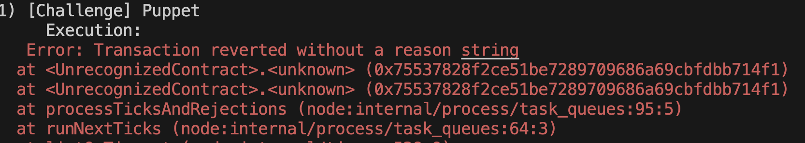
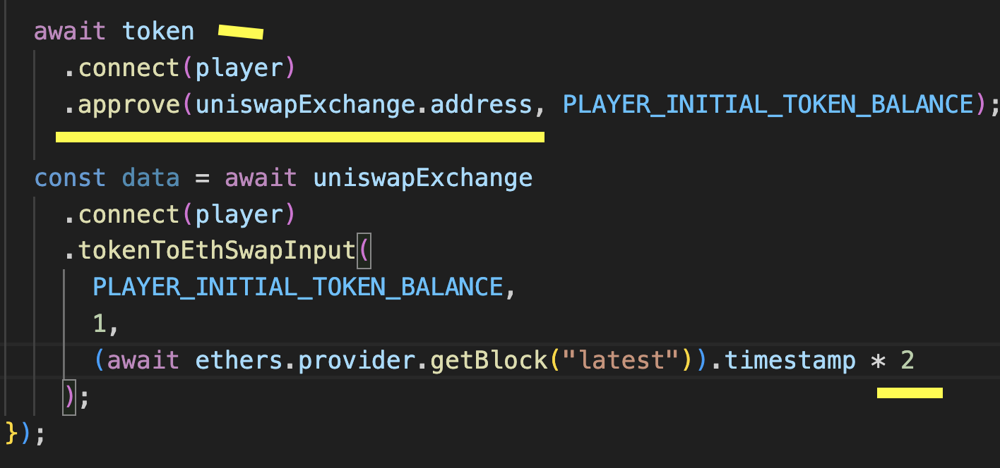

**A set of challenges to learn offensive security of smart contracts in Ethereum.**

Featuring flash loans, price oracles, governance, NFTs, lending pools, smart contract wallets, timelocks, and more!

## Play

Visit [damnvulnerabledefi.xyz](https://damnvulnerabledefi.xyz)

## Help

For Q&A and troubleshooting running Damn Vulnerable DeFi, go [here](https://github.com/tinchoabbate/damn-vulnerable-defi/discussions/categories/support-q-a-troubleshooting).

## Disclaimer

All Solidity code, practices and patterns in this repository are DAMN VULNERABLE and for educational purposes only.

DO NOT USE IN PRODUCTION.

## Comparison

command to run test -> npx hardhat test puppet.challenge.js About to use github linker and "@audit" tag to document stuff in .md file as mentioned here

---- before executing the code ------

I was unable to write report, because I dont have any clue how to write a good report.

Also a condition is given stating that you have to do it in one transaction, Which is not possible.

** DO NOT READ FURTHER BELOW IF YOU HAVE NOT ALREADY TRIED SOLVING ** - highly recommended.

## Solution :

same code as url

## Concepts Learned :

1. how uniswap exchange works.
2. approve is required before calling uniswap api.

## Hack & How to stop it

here the pool is dependent on uniswap for its rate calculation but here uniswap is and always will be exchangable means it can be modified, so solution would be to not rely on the uniswap if you are then borrowAmount has to be multiplied with balance of uniswap before dividing it with token amount.

## ERRORS I got :

The above shown image is the ERROR I encounterd if anything goes wrong, when mutating "UNISWAP".

As you can already sense its very unclear to track the issue, because reverted without a reason string.

Below are the following things that gave me this error so I have listed them and also what to write instead of it to make the error go away.

1. when trying to perform any kind of token/eth mutation, ** REMEMBER ** to approve "UNISWAP" to perform actions on behalf of you.

2. when giving the deadline argument, remember to give multiplied by 2 or more but not just current timestamp.

please refer the screenshot added above.
