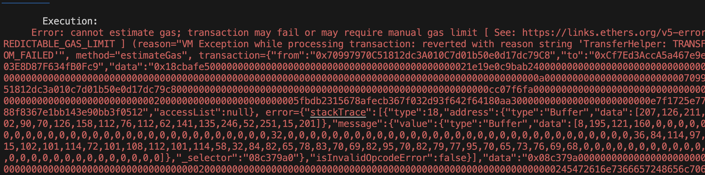

**A set of challenges to learn offensive security of smart contracts in Ethereum.**

Featuring flash loans, price oracles, governance, NFTs, lending pools, smart contract wallets, timelocks, and more!

## Play

Visit [damnvulnerabledefi.xyz](https://damnvulnerabledefi.xyz)

## Help

For Q&A and troubleshooting running Damn Vulnerable DeFi, go [here](https://github.com/tinchoabbate/damn-vulnerable-defi/discussions/categories/support-q-a-troubleshooting).

## Disclaimer

All Solidity code, practices and patterns in this repository are DAMN VULNERABLE and for educational purposes only.

DO NOT USE IN PRODUCTION.

## Comparison

command to run test -> npx hardhat test puppetv2.challenge.js About to use github linker and "@audit" tag to document stuff in .md file as mentioned here

---- before executing the code ------

I was unable to write report, because I dont have any clue how to write a good report.

** DO NOT READ FURTHER BELOW IF YOU HAVE NOT ALREADY TRIED SOLVING ** - highly recommended.

## Must know before solve :

[here](https://medium.com/@JohnnyTime/damn-vulnerable-defi-v3-challenge-9-solution-puppet-v2-complete-walkthrough-48cd878f275e)

the url deploys the contract, but I did not. And honestly I dont think its an issue.

The main idea remains same.

## Solution :

- as of now it was similar to puppet1.

## Concepts Learned :

- how uniswapV2 works, honeslty I spent ton of hours just to realize which function of which contract instances given as :

uniswapFactory, uniswapExchange, uniswapRouter to be used to trade with the contract.

but this was really helpfull as I also for the first time solely worked on my docs reading ability and testing whatever I understood.

So kudos !

## Hack & How to stop it

the hack was pretty similar to V1.

## ERRORS I got :

1. Below error is also due to not approving uniswapRouter/weth to withdraw amount on your behalf.
   
